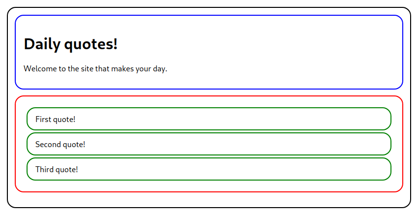
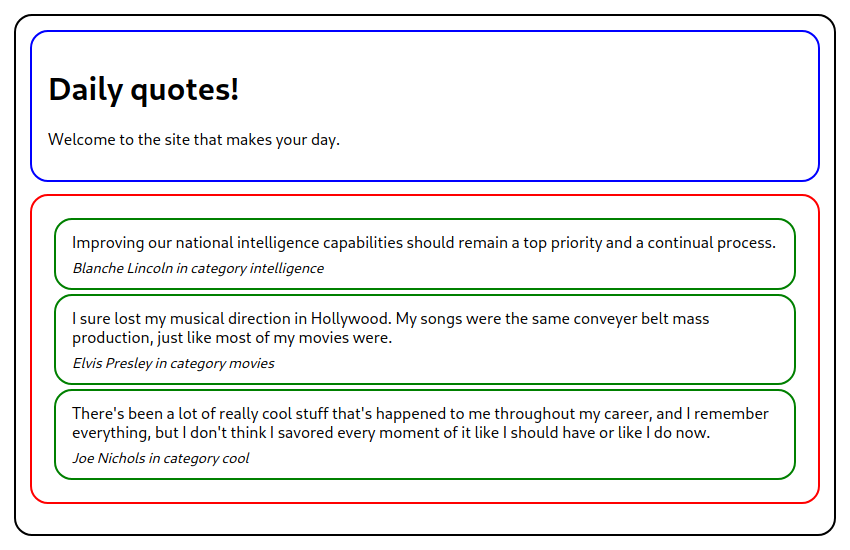
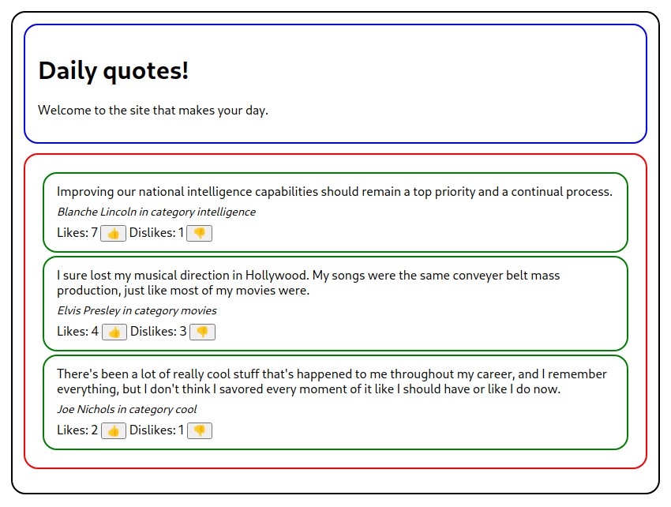

# React Dojos

## Dojo #1: Random quote table

Create a React app that fetches quotes from a random quotes API!

### Step 1: Displaying the quotes

Objective: split your React application into 4 components:

- `App` (black)
- `Header` (blue)
- `QuoteList` (red)
- `Quote` (green)

And integrate some basic data.

### Step 2 : Detailed display of each quote

Objective : use props to pass all relevant data to your `Quote` component and have the detail about each quote :

- The quote itself
- The author
- The category

To do this, you can use the following api : [Quotes API](https://api-ninjas.com/api/quotes). It will give you directly usable data.

> ⚠ **Attention**, Check out the API docs first and have a look at the response by calling the API directly in your browser - it will help you when consuming the data in React with fetch or Axios 😄

### Step 3: Storing likes

Goal: use `state` and `event handlers` to handle click events and update data.

### Step 4: Bonus - CSS

Goal: Make it look attractive, it's looking a little rough right now. Tinker around with the CSS.

## Dojo #2: The Anti-TODO list

To change a bit from the classic TODO list, we ask you to make a list of things not to do.

### Step 1: Display the Anti-TODO list

Objective: create a simple wireframe for a mini Anti-TODO list.

You will choose the way you want to display your Anti-TODO list.

> This step can be done all together, no need to start the timer in Dojo mode!

### Step 2 : Break down each item into components

Goal: split your React application into several components.

A possible breakdown could be :

- `App`
- `Header`
- `ItemForm`
- `ItemList`
- `Item`

### Step 3: Add items to the list

Objective: Add an item to the list via the new item form.

### Step 4: Manage the validation of an anti completion

Objective: Mark an item in the list as anti-done using a checkbox. You can change the style of the item (gray color, italic style and strikethrough).
